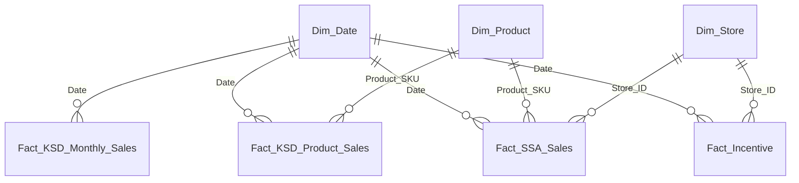

# คู่มือการใช้งาน Microsoft Power BI Desktop: Pharma Alliance (PAC)

เอกสารนี้แนะนำขั้นตอนการนำชุดข้อมูลในโฟลเดอร์ `PowerBI_DataModel/` ไปเปิดใช้งานและสร้างรายงานบนโปรแกรม **Microsoft Power BI Desktop** แบบสมบูรณ์

---

## 🏗️ 1. สถาปัตยกรรมข้อมูล (Star Schema Data Model)

ชุดข้อมูลถูกออกแบบตามหลักการ **Star Schema Best Practice** เพื่อให้การคำนวณรวดเร็ว รองรับ Slicers และ Time Intelligence (YoY, YTD, MoM) ได้อย่างแม่นยำ:



### รายละเอียดตาราง (Tables Overview):

| ชื่อตาราง | ประเภท | จำนวนแถว | วัตถุประสงค์หลัก |
|:---|:---|:---|:---|
| **`Dim_Product.csv`** | Dimension | 216 | ข้อมูลหลักของยาและสินค้า (SKU, ชื่อลาว, ชื่ออ่านไทย, ชื่อ PAC, กลุ่มแบรนด์, สินค้ากลยุทธ์, ค่าเชียร์) |
| **`Dim_Store.csv`** | Dimension | 6 | สาขาร้านยาใสสะอาด 6 สาขา (SSA1 ถึง SSA7) พร้อมชื่อสาขาภาษาไทย |
| **`Dim_Date.csv`** | Dimension | 730 | ปฏิทิน 2025-2026 รองรับการคำนวณ YoY, YTD, Quarter และ Month |
| **`Dim_SalesRep.csv`** | Dimension | 23 | พนักงานขายและทีมจัดจำหน่าย KSD |
| **`Fact_KSD_Product_Sales.csv`** | Fact | 2,022 | รายการขายสินค้ารายเดือนฝั่ง KSD (ยอดขาย THB, จำนวนชิ้น, ออเดอร์, กลุ่มสินค้า) |
| **`Fact_KSD_Monthly_Sales.csv`** | Fact | 20 | ภาพรวมยอดขายรายเดือน KSD Sell-out แยกช่องทาง SSA และค้าส่ง |
| **`Fact_SSA_Sales.csv`** | Fact | 385 | รายการขายหน้าร้านยา SSA แยกรายสาขาและรายสินค้า (LAK / THB) |
| **`Fact_Incentive.csv`** | Fact | 1,850 | ประวัติการจ่ายค่าเชียร์ 17 เดือน (เม.ย. 2025 - ส.ค. 2026) รายสินค้าและรายสาขา |

---

## 🚀 2. ขั้นตอนการนำเข้า Power BI Desktop (3 ขั้นตอนง่ายๆ)

### ขั้นตอนที่ 1: นำเข้าข้อมูล (Get Data)
1. เปิดโปรแกรม **Microsoft Power BI Desktop** (ดาวน์โหลดฟรีได้จาก Microsoft Store หรือเว็บทางการ)
2. คลิกที่ปุ่ม **"Get Data"** (รับข้อมูล) บนแถบ Ribbon ด้านบน
3. เลือก **"Folder"** (โฟลเดอร์) แล้วเลือกไปที่โฟลเดอร์:
   `D:\Antigravity\SSA ยอดขาย\PowerBI_DataModel`
   *(หรือเลือก Text/CSV เพื่อนำเข้าทีละไฟล์ตามความสะดวก)*
4. คลิก **"Combine & Transform Data"** หรือ **"Load"** เข้าสู่โมเดล

### ขั้นตอนที่ 2: ผูกความสัมพันธ์ (Manage Relationships)
ไปที่มุมมอง **Model View** (ไอคอนรูปตารางเชื่อมโยงด้านซ้าย) และตรวจสอบเส้นความสัมพันธ์:
- ลาก `Dim_Date[Date]` ➔ `Fact_KSD_Product_Sales[Date]` (1 to Many)
- ลาก `Dim_Date[Date]` ➔ `Fact_SSA_Sales[Date]` (1 to Many)
- ลาก `Dim_Date[Date]` ➔ `Fact_Incentive[Date]` (1 to Many)
- ลาก `Dim_Product[Product_SKU]` ➔ `Fact_SSA_Sales[Product_SKU]` (1 to Many)
- ลาก `Dim_Product[Product_SKU]` ➔ `Fact_KSD_Product_Sales[Product_SKU]` (1 to Many)
- ลาก `Dim_Store[Store_ID]` ➔ `Fact_SSA_Sales[Store_ID]` (1 to Many)

### ขั้นตอนที่ 3: ติดตั้งธีมสี Pharma Alliance
1. ไปที่เมนู **View** (มุมมอง) บน Ribbon
2. คลิกที่ลูกศรดรอปดาวน์ตรง **Themes** (ชุดรูปแบบ)
3. เลือก **"Browse for themes"** (เรียกดูชุดรูปแบบ)
4. เลือกไฟล์: `D:\Antigravity\SSA ยอดขาย\PowerBI_DataModel\PAC_PowerBI_Theme.json`
5. ชาร์ตและการ์ดทั้งหมดจะเปลี่ยนเป็นชุดสีของ Pharma Alliance & Power BI ทันที!

---

## 🧮 3. การเพิ่มสูตรคำนวณ DAX Measures

เปิดไฟล์ `PowerBI_DataModel/PowerBI_DAX_Measures.dax` ด้วยโปรแกรม Notepad หรือ VS Code แล้วคัดลอกสูตรไปสร้างเป็น **New Measure** ใน Power BI ได้ทันที:

### สูตรสำคัญตัวอย่าง:
```dax
// ยอดขาย KSD รวม (บาท)
[Total KSD Revenue THB] = SUM('Fact_KSD_Product_Sales'[Amount_THB])

// ยอดขายสินค้ากลยุทธ์ PAC
[Strategic KSD Revenue THB] = 
CALCULATE([Total KSD Revenue THB], 'Fact_KSD_Product_Sales'[Is_Strategic] = "Yes")

// สัดส่วนยอดขายสินค้ากลยุทธ์ (%)
[Strategic Revenue Share %] = DIVIDE([Strategic KSD Revenue THB], [Total KSD Revenue THB], 0)

// ยอดขายเปรียบเทียบปีที่แล้ว YoY Growth %
[KSD Revenue YoY Growth %] = 
VAR CurrentSales = [Total KSD Revenue THB]
VAR PreviousYearSales = CALCULATE([Total KSD Revenue THB], SAMEPERIODLASTYEAR('Dim_Date'[Date]))
RETURN DIVIDE(CurrentSales - PreviousYearSales, PreviousYearSales, 0)

// ยอดรวมค่าเชียร์ 17 เดือน (บาท)
[Total Incentive Paid THB] = SUM('Fact_Incentive'[Incentive_Amount_THB])

// อัตราการกระจายสินค้ากลยุทธ์ในร้านยา SSA (%)
[Strategic SKU Penetration Rate %] = DIVIDE([Sold Strategic SKUs], [Total Strategic SKUs], 0)
```

---

## 🔄 4. การอัปเดตข้อมูลในอนาคต

เมื่อมีข้อมูลเดือนใหม่ (เช่น เดือนกันยายน หรือเดือนถัดไป):
1. นำไฟล์เดือนใหม่ใส่โฟลเดอร์ `Data/`
2. ดับเบิลคลิกหรือรันคำสั่ง:
   ```bash
   python export_powerbi_model.py
   ```
3. เปิดไฟล์ Power BI Desktop แล้วกดปุ่ม **"Refresh"** ที่แถบ Ribbon ด้านบน ข้อมูลในรายงานจะอัปเดตอัตโนมัติทันที 100%!
